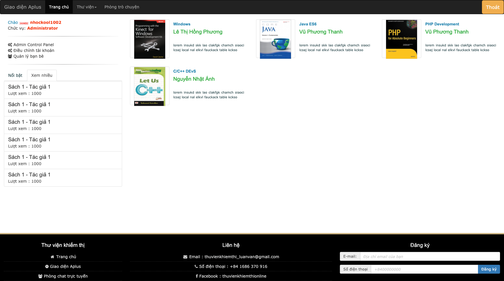
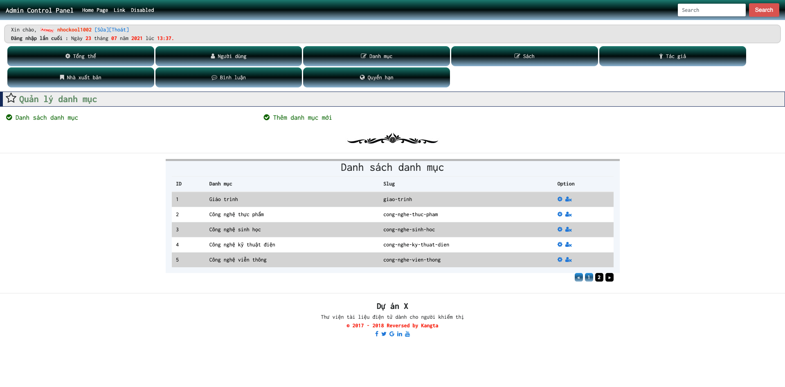
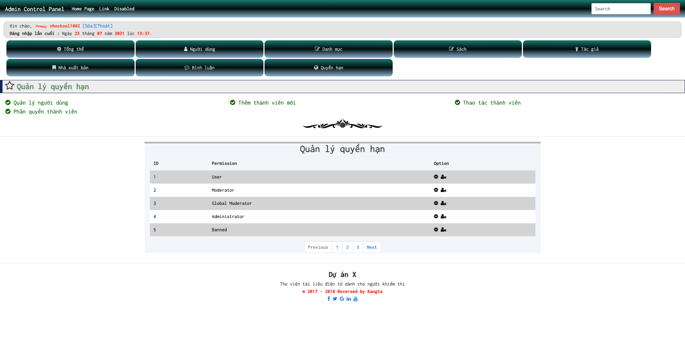
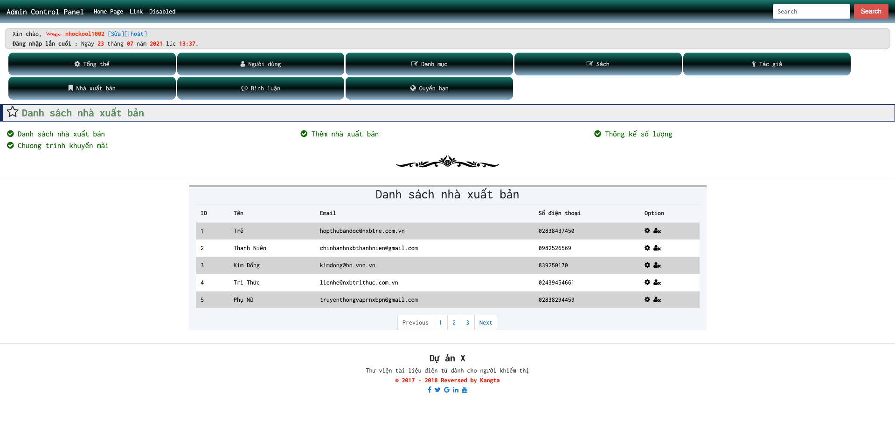

# ** BlackAndWhite - Library for visually impaired students **

# ** BlackAndWhite v2 - Thư viện điện tử dành cho sinh viên khiếm thị **

## **Setup - Cài đặt**

- Step 1 : cd data, chạy composer install
- Step 2 : Chạy php artisan key:generate
- Step 3 : Điều chỉnh thông tin connect DB trong app/database.php, .env
- Step 3 : Chạy Migrate và Seed

## **Picture - Hình ảnh**

**Home - Trang chủ**

**Admin - Quản trị**

